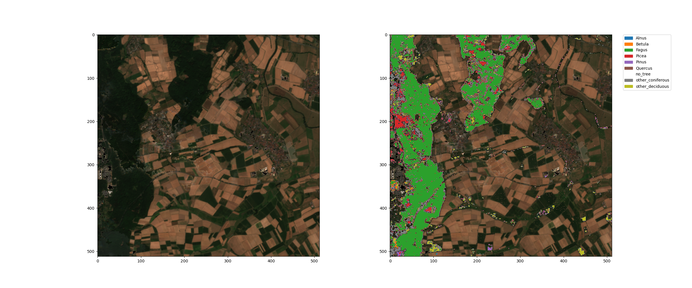
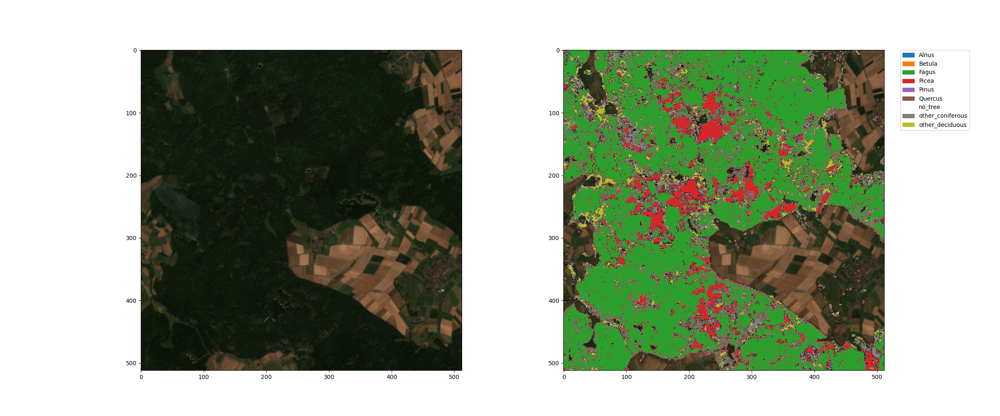
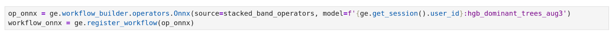

Mehr als 30 Prozent der Landfläche Deutschlands sind Wald[^1]. Im Kontext von Klimawandel und Biodiversität ist es wichtig für jeden Standort, die Zusammensetzung der Baumarten und besonders die Veränderung aus Satellitendaten erkennen zu können. In der Forschung gibt es viele Methoden des **Maschinellen Lernens** (ML), die hervorragende Ergebnisse zeigen. Mit der Geo Engine unterstützen wir sowohl das Training solcher Modelle als auch deren Überführung in operationelle Services.

Für die **Klassifikation von Baumarten** haben wir ein entsprechendes Modell für ganz Deutschland trainiert und dieses in die Geo Engine integriert. Dabei nutzen wir die frei verfügbaren **Sentinel-2** Daten mit 10 m Pixelgröße, die wir für jedes Jahr auf (wolkenfreie) Monate aggregieren und so eine Klassifikation pro Jahr ermöglichen.

Unser ML-Modell kann zum aktuellen Stand die folgenden Bäume erkennen: Birken (Betula), Erlen (Alnus), Eichen (Quercus), Buchen (Fagus), Fichten (Picea), Kiefern (Pinus) sowie andere Laubbäume (deciduous) und Nadelbäume (coniferous) erkennen. Die **Accuracy** beträgt **93 %**. Die Confusion Matrix zeigt die Qualität des Models für die einzelnen Arten und mögliche Verwechslungen:


Mit nur wenigen Zeilen Python-Code kann dieses und auch viele andere Modelle in die Geo Engine importiert werden. Die Geo Engine nutzt dazu das ONNX Format um ML Modelle aus beliebigen ML Frameworks anzuwenden. Hier sieht man, dass zum Import nur das Modell, ein Name und eine Beschreibung sowie Informationen zu den Datentypen angegeben werden müssen:

```python

metadata = ge.ml.MlModelMetadata(
    file_name="hgb_dominant_trees4.onnx",
    input_type=geoc.models.RasterDataType.F32,
    num_input_bands=97,
    output_type=geoc.models.RasterDataType.I64,
)

model_config = ge.ml.MlModelConfig(
    name=f"{ge.get_session().user_id}:hgb_dominant_trees4",
    metadata=metadata,
    display_name="Dominante Baumarten",
    description="Ein HistGradientBoost Modell für Baumarten",
)

ge.register_ml_model(onnx_model, model_config)

```

Mit noch weniger Code kann das Modell dann in einen Workflow integriert werden. Wie man hier sieht muss dazu lediglich der ONNX-Operator zu einem Workflow, der die passenden Inputdaten hinzu gefügt und der Name des gewünschten Modells angegeben werden:

```python

op_onnx = ge.workflow_builder.operators.Onnx(
    source=stacked_band_operators,
    model=f'{ge.get_session().user_id}:hgb_dominant_trees4'
    )

workflow_onnx = ge.register_workflow(op_onnx)

```

Eine Anfrage an einen Workflow mit dem Modell liefert direkt die Klassifikation der Baumarten für die Region und das Jahr von Interesse. So kann man die Geo Engine nutzen, um trainierte **Modelle als operationellen Dienst** bereitzustellen und für beliebige Gebiete und anfragen über verschiedene Zeitpunkte nutzbar zu machen.

Hier sind Beispiele für die Baumarten-Klassifikation neben den jeweiligen Sentinel-2 RGB-Komposit aus der Region um Marburg (Lahn) im Jahr 2018:





Hier erkennt man, dass die Waldflächen, die man im RGB-Bild deutlich als dunkelgrüne Flächen erkennen kann, in der Klassifikation als Baumstandorte erkannt wurden. Die verschiedenen Farben in der Klassifikation zeigen die Baumart an, die auf dem jeweiligen 10m-Pixel dominant ist. Die pinken Flächen sind Baumfrei, die grünen Flächen sind von Buchen dominiert und die roten Flächen sind durch Fichten dominiert. Die anderen Arten sind auf deutlich weniger Flächen zu finden.

Zum Training verwendet wurden die folgenden Daten:

- Freudenberg, M., Schnell, S., Magdon, P., 2024\. Sentinel-2 machine learning dataset for tree species classification in Germany. [https://doi.org/10.3220/DATA20240402122351-0](https://doi.org/10.3220/DATA20240402122351-0)
- Copernicus Land Monitoring Service. Dominant Leaf Type 2018\. [https://land.copernicus.eu/en/products/high-resolution-layer-forests-and-tree-cover?tab=dominant_leaf_type](https://land.copernicus.eu/en/products/high-resolution-layer-forests-and-tree-cover?tab=dominant_leaf_type)
- U.S. Geological Survey. (2014). _SRTM 1 Arc-Second Global (30m)_ \[Digital Elevation Model\]. U.S. Geological Survey. [https://earthexplorer.usgs.gov/](https://earthexplorer.usgs.gov/)

## Fazit

Mit der Geo Engine ist es sehr einfach, Modelle für konkrete Fragestellungen in operationelle Services zu übersetzen. Unser Modell zur Klassifikation von Baumarten zeigt eine sehr gute Accuracy und stellt so ein interessantes Datenprodukt für verschiedene Anwendungen z.B. Waldmonitoring, ESG-Reporting oder Biodiversitätsforschung dar.

<!-- TODO -->

Bei Fragen zur Geo Engine oder unserem Baumtyp-Dataset wenden Sie sich gerne an info@geoengine.de.

## Referenzen

[^1]: _Der Wald in Deutschland \- ausgewählte Ergebnisse der vierten Bundeswaldinventur (2024)_
