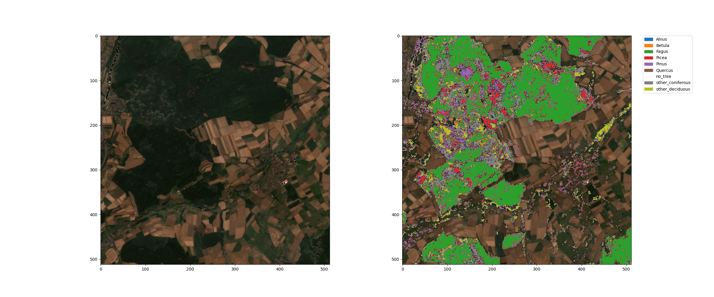
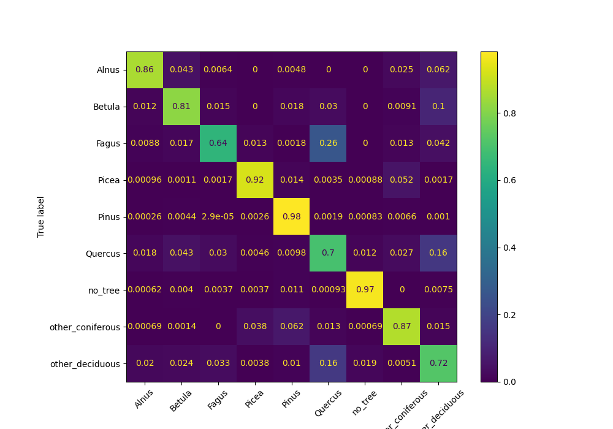
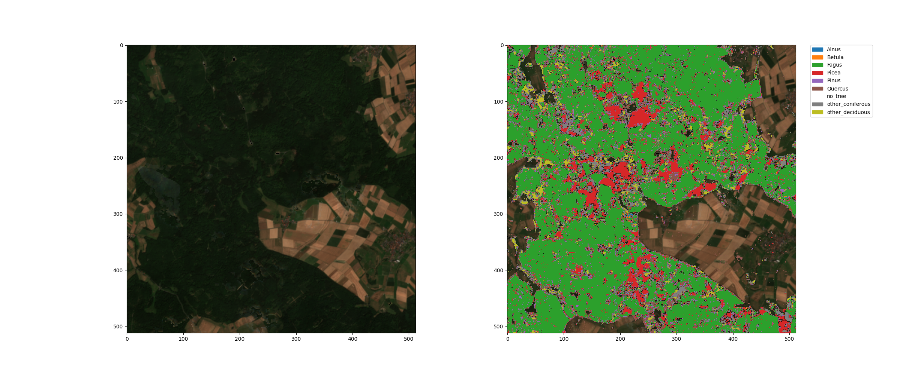

More than 30 per cent of Germany's land area is covered by forests [1]. In the context of climate change and biodiversity, it is important for each location to be able to recognise and analyse changes in the composition of tree species using satellite data. In the field of research, many **Machine Learning (ML)** methods have been shown to produce excellent results. With the Geo Engine, we support the training of such models and their integration into operational services.



We have trained a model for the **classification of tree species** for the whole of Germany and integrated it into the Geo Engine. We use freely available Sentinel-2 data with a pixel size of 10 m, which we aggregate into cloud-free months for each year, thus enabling classification on an annual basis.  The image above shows the results of the model using an example. On the left is a cloud-free **Sentinel-2** RGB composite for July 2018. On the right, you can see the classification of the dominant tree species, which our trained model provides as an overlay.

Our ML model can currently recognise the following tree species: Birch (Betula), alder (Alnus), oak (Quercus), beech (Fagus), spruce (Picea), pine (Pinus), and other deciduous and coniferous trees. The **accuracy** is **93%**. The confusion matrix shows the model's performance for each species and possible misclassifications.



The trained model can be imported into the Geo Engine with just a few lines of Python code, just like many other models. The Geo Engine uses the ONNX format to integrate machine learning (ML) models from any ML framework. The following code example shows that the only things that need to be specified for the import are the model itself, a name, a description and information on the data types.

```python

metadata = ge.ml.MlModelMetadata(
    file_name="hgb_dominant_trees4.onnx",
    input_type=geoc.models.RasterDataType.F32,
    num_input_bands=97,
    output_type=geoc.models.RasterDataType.I64,
)

model_config = ge.ml.MlModelConfig(
    name=f"{ge.get_session().user_id}:hgb_dominant_trees4",
    metadata=metadata,
    display_name="Dominante Baumarten",
    description="Ein HistGradientBoost Modell für Baumarten",
)

ge.register_ml_model(onnx_model, model_config)

```

The model can then be integrated into a workflow using even less code.
As you can see here, all that is required is for the ONNX operator to be added to a workflow that generates the appropriate input data, along with the name of the desired model.

```python

op_onnx = ge.workflow_builder.operators.Onnx(
    source=stacked_band_operators,
    model=f'{ge.get_session().user_id}:hgb_dominant_trees4'
    )

workflow_onnx = ge.register_workflow(op_onnx)

```

In most cases, the workflow that generates the training data can also be used to provide the data for applying the model. It just operates in a different place and/or time.
Requesting a workflow with the model directly provides the classification of tree species for the region and year of interest. This means that the Geo Engine can provide trained **models as an operational service** and make them usable for any areas and queries at different points in time.

The following examples show the classification of tree species alongside the respective Sentinel-2 RGB composite from the Marburg (Lahn) region in 2018:




As you can see here, the forest areas, which are clearly visible as dark green in the RGB image, were identified as tree locations in the classification. The different colours in the classification indicate the dominant tree species in each 10 m pixel. Transparent areas are free of trees, green areas are dominated by beech trees, and red areas are dominated by spruce trees. Other species are found in significantly fewer areas.

The following data was used for training:

- Freudenberg, M., Schnell, S., Magdon, P., 2024\. Sentinel-2 machine learning dataset for tree species classification in Germany. [https://doi.org/10.3220/DATA20240402122351-0](https://doi.org/10.3220/DATA20240402122351-0)
- Copernicus Land Monitoring Service. Dominant Leaf Type 2018\. [https://land.copernicus.eu/en/products/high-resolution-layer-forests-and-tree-cover?tab=dominant_leaf_type](https://land.copernicus.eu/en/products/high-resolution-layer-forests-and-tree-cover?tab=dominant_leaf_type)
- U.S. Geological Survey. (2014). _SRTM 1 Arc-Second Global (30m)_ \[Digital Elevation Model\]. U.S. Geological Survey. [https://earthexplorer.usgs.gov/](https://earthexplorer.usgs.gov/)

## Fazit

The Geo Engine makes it easy to translate models for specific issues into operational services. Our tree species classification model is highly accurate and therefore an interesting data product for various applications, such as forest monitoring, ESG reporting and biodiversity research.

The model produces excellent results, particularly for contiguous forest areas, as demonstrated by the examples and confusion matrix. Based on these results, we will further develop the model and create an additional change dataset alongside the classification of tree species, in order to offer changes between different years as a service.

If you have any questions about the Geo Engine, our tree species dataset, or customised services, please email info@geoengine.de.

## Referenzen

[^1]: _Der Wald in Deutschland \- ausgewählte Ergebnisse der vierten Bundeswaldinventur (2024)_
